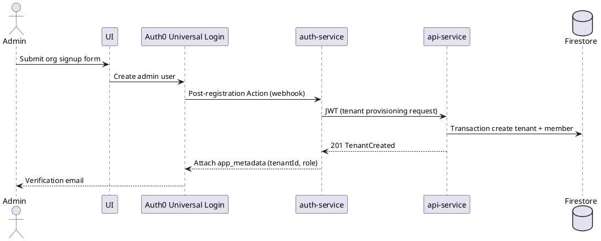
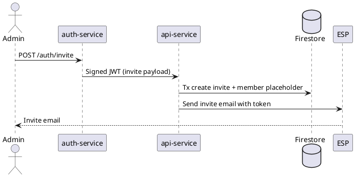
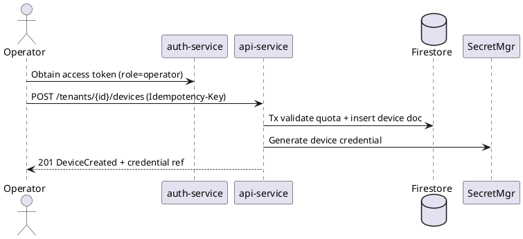

## Organization Creation Design Plan

### 0. Meta & Governance
- **Scope & Goals**: Deliver an end-to-end organization signup experience that provisions a tenant, initializes the admin account pending verification, allows verified admins to invite additional users, and restricts device creation to admins/operators. Showcase distributed backend best practices on Firestore + Auth0.
- **Non-Goals**: Billing automation, UI design, legacy data migration, on-prem deployments, non-email invite channels.
- **Threat Model**:
  - Assets: tenant configuration, user identities, device credentials, audit trail.
  - Actors: legitimate administrators, tenant users, internal services, external attackers (phishing, credential stuffing, API abuse), compromised devices.
  - Trust Boundaries: Browser/UI ↔ Auth0, Auth0 ↔ auth-service, auth-service ↔ api-service, api-service ↔ Firestore, api-service ↔ external notification provider.
  - Top Risks & Mitigations:
    1. Token replay or theft → short-lived JWTs with `jti`, store revocation list, enforce TLS/mTLS.
    2. Cross-tenant data access → tenant-scoped Firestore paths, middleware tenant assertions, automated tests.
    3. Invite abuse/spam → CAPTCHA + rate limits + per-tenant invite quotas.
    4. Device credential leakage → Secret Manager storage, rotate on compromise, limit API visibility.
    5. Auth0 outage → circuit breaker with retry/backoff, degraded-mode queuing for non-critical actions.
- **Sequence & Component Diagrams**: Source of truth stored under `docs/design/diagrams/`. Quick reference excerpts:







- **Config Matrix**:

| Key | Service | Description | Default | Notes |
| --- | --- | --- | --- | --- |
| `AUTH0_DOMAIN` | auth-service | Auth0 domain | required | Used for JWKS + management API |
| `AUTH0_CLIENT_ID` | auth-service | Machine-to-machine client | required | Least privilege scope |
| `AUTH0_CLIENT_SECRET` | auth-service | Secret for management API | secret | Stored in Secret Manager |
| `ORG_SIGNUP_SIGNING_KEY_ID` | auth-service | Asymmetric key id for inter-service JWT | required | Rotate quarterly |
| `ORG_SIGNUP_PRIVATE_KEY` | auth-service | PEM payload | secret | mTLS + HSM preferred |
| `API_REQUEST_JWT_TTL_SECONDS` | both | TTL for inter-service JWT | 60 | Rarely exceeds request duration |
| `FIRESTORE_PROJECT_ID` | api-service | Firestore project | required | |
| `RATE_LIMIT_SIGNUP_PER_IP` | api-service | Sliding window limit | 5/hour | Redis backed |
| `RATE_LIMIT_INVITE_PER_TENANT` | api-service | Sliding window limit | 20/hour | Configurable |
| `INVITE_TTL_HOURS` | api-service | Invite expiry | 72 | Aligned with business policy |
| `DEFAULT_DEVICE_QUOTA` | api-service | Devices per tenant | 100 | Configurable per plan |
| `SESSION_ACCESS_TOKEN_TTL` | auth-service | Access token lifetime | 900 | Seconds |
| `SESSION_REFRESH_TOKEN_TTL` | auth-service | Refresh lifetime | 1209600 | 14 days |
| `HTTP_TIMEOUT_CONNECT_MS` | both | Upstream connect timeout | 200 | |
| `HTTP_TIMEOUT_TOTAL_MS` | both | Request deadline | 2000 | |
| `METRICS_EXPORT_INTERVAL_SEC` | both | OpenTelemetry flush | 30 | |
| `AUDIT_LOG_EXPORT_BUCKET` | api-service | GCS bucket | optional | For archival |

- **Rollout Plan**: Guard new flows behind `ORG_SIGNUP_V2` and `DEVICE_RBAC_ENFORCEMENT` feature toggles. Default disabled in production, enabled in staging for integration tests. Rollout sequence: dev → staging (week 1) → canary tenants (week 2) → full release. Rollback by disabling toggles; keep legacy endpoints intact for 1 release cycle.

### 1. Architecture & Trust Boundaries
- **Services**: `auth-service` (Auth0 integration, invite token minting, verification webhooks) and `api-service` (tenant/user/device domain logic, Firestore access). Both run stateless behind API gateway; share tracing headers.
- **Inter-service Auth**: auth-service signs per-request JWTs (`RS256`, `iss=auth-service`, `aud=api-service`, `exp<=60s`, `jti` random UUID). API validates signature + `jti` uniqueness (Redis nonce store, TTL=2m). Services communicate over private network with mTLS terminating at gateway (client cert rotation every 90 days).
- **Token Verification at Edge**: API gateway caches Auth0 JWKS (TTL=5m, background refresh). JWT claims validated for `iss`, `aud`, `exp`, `nbf`, `azp`, `tenant_id`, `role`. Failure leads to 401 with opaque `auth_failed` code.
- **Tenant Isolation**: Firestore paths begin with tenant id; API attaches tenant id to request context and enforces on queries and writes. Firestore security rules double-enforce by verifying custom auth claims when direct client access used (dev tooling only).
- **Request Signing / Nonce**: Sensitive operations (invite create, device create/delete) require `X-Request-JWT` minted by auth-service with 30s TTL and nonce; API rejects reused nonces.

### 2. Domain Model (Firestore)
- **Collections / Docs & Required Fields**:
  - `tenants/{tenantId}`: `tenantId`, `organizationId`, `name`, `slug`, `status`, `createdAt`, `createdByUserId`, `limits` (`maxUsers`, `maxDevices`, `maxInvitesPerDay`), `settings` (map), `suspensionReason?`.
  - `tenants/{tenantId}/members/{userId}`: `userId`, `email`, `role`, `status`, `invitedBy`, `invitedAt`, `acceptedAt?`, `emailVerifiedAt?`, `auth0UserId`, `lastLoginAt?`, `mfaEnabled`.
  - `tenants/{tenantId}/devices/{deviceId}`: `deviceId`, `displayName`, `hardwareId`, `status`, `addedByUserId`, `createdAt`, `updatedAt`, `credentialsRef`, `tags`, `lastSeenAt?`, `deletedAt?`.
  - `invites/{inviteId}`: `inviteId`, `tenantId`, `email`, `role`, `tokenHash`, `issuedAt`, `expiresAt`, `status`, `invitedBy`, `redeemedBy?`, `redeemedAt?`.
  - `ops_audit/{logId}`: `logId`, `tenantId`, `actorUserId`, `actorRole`, `action`, `resourceType`, `resourceId`, `changes`, `requestId`, `performedAt`, `ipAddress`, `userAgentHash`.
- **Uniqueness Strategy**: Maintain compound key `tenants/{tenantId}/members` with doc id = Auth0 user id. Additionally store `unique_members/{tenantId}__{emailHash}` sentinel doc (empty) to enforce uniqueness. Invites use `inviteId = hash(tenantId|email|issuedAt)` with TTL index to avoid duplication.
- **Composite Indexes**:
  - Members by `(tenantId ASC, role ASC, status ASC)`.
  - Devices by `(tenantId ASC, status ASC, createdAt DESC)`.
  - Invites by `(tenantId ASC, status ASC, expiresAt ASC)`.
  - Audit logs by `(tenantId ASC, performedAt DESC)`.
- **Hot Partition Avoidance**: Use `tenantId` as partition but add 4-char hash prefix on high-write subcollections (`devices`, `audit_logs`) when writes exceed 500 ops/sec. Example doc path: `devices/{hashPrefix}_{deviceId}`. Spread invites with random 8-byte suffix appended to `inviteId`.

### 3. RBAC & Policy
- **Roles & Permissions**:

| Role | Tenant Settings | Invite Users | Manage Devices | View Data | Manage Billing |
| --- | --- | --- | --- | --- | --- |
| ADMIN | yes | yes | yes | yes | future |
| OPERATOR | limited (device policies) | no | yes | yes | no |
| READ_ONLY | no | no | no | yes | no |

- **Enforcement Helpers**: `require_role(*roles)` decorator in api-service ensuring role + `emailVerifiedAt` before executing handler; `with_tenant_scope` ensures path tenant matches token claim.
- **Extensibility**: Roles map to permissions array stored in Firestore `tenant.settings.permissions`. Future custom roles can be added by storing scopes (e.g., `devices.write`) and updating policy evaluation to check set membership.

### 4. Auth0 Integration (auth-service)
- **Email Verification Gate**: Rely on Auth0 `email_verified` claim. auth-service rejects token issuance for unverified admins except for verification endpoints.
- **User Metadata Mapping**: Auth0 `user.app_metadata` holds `{ tenantId, role, inviterUserId }`; `user.user_metadata` holds profile data. auth-service syncs Firestore on login via Actions.
- **Session Model**: Short-lived access JWT (`exp=15m`, `jti` random) + refresh token (`exp=14d`, `rotating=true`). Store last valid `session_epoch` in Firestore to invalidate sessions on compromise. `jti` stored in Redis for logout events (TTL=access token lifetime).
- **Invite Flow**: auth-service requests Auth0 passwordless email link or uses Management API to create user in `blocked` state, embedding invite token in app_metadata. Accepting invite unblocks user, sets password via hosted page, marks Firestore member active.
- **Key Management**: JWKS fetched every 5 minutes with background refresh; fallback to cached keys (max age 1 hour). Kid rotation handled by observing `Cache-Control` headers and forcing refresh when `kid` unknown.

### 5. Critical User Flows
- **Org Sign-Up** (`POST /orgs/signup`): Validate payload, enforce idempotency key, call auth-service for signed provisioning JWT, run Firestore transaction (create organization, tenant, admin member, audit log), emit `TenantCreated` event, 202 response with verification pending message.
- **Admin Verify & First Login**: Auth0 email link -> verification Action -> auth-service webhook -> api-service updates member status to `active`, tenant status to `active` if first admin verified, create audit entry, optionally send welcome email. First login issues tokens and returns tenant dashboard URL.
- **Invite User** (`POST /tenants/{id}/users/invite`): Admin only, rate limited, audit logged. Creates invite doc + member placeholder, sends email, returns 202 with invite id.
- **Accept Invite** (`POST /auth/accept-invite`): Validate token, ensure not expired, Firestore transaction updates member to `active`, attaches Auth0 metadata, deletes sentinel duplicates, audit log. Returns tokens via Auth0 hosted page redirect.
- **Device Create/Delete** (`POST/DELETE /tenants/{id}/devices/{deviceId}`): Requires admin/operator. Create flow validates quotas, writes device doc, stores credentials ref, audit log. Delete is soft delete (`deletedAt` set) plus `DeviceDeleted` event; actual credential revocation handled asynchronously.

### 6. API Design (api-service)
- **Endpoints Summary**:

| Endpoint | Method | Auth | Request Highlights | Response |
| --- | --- | --- | --- | --- |
| `/orgs/signup` | POST | public + Idempotency-Key | org name, admin email, captcha token | 202 `{ tenantId, status }`
| `/auth/events/email-verified` | POST | auth-service JWT | `auth0UserId`, `tenantId` | 204 |
| `/tenants/{tenantId}` | GET | access JWT | none | 200 tenant summary |
| `/tenants/{tenantId}/users` | GET | access JWT | pagination params | 200 list |
| `/tenants/{tenantId}/users/invite` | POST | admin access JWT + request JWT | invite payload | 202 `{ inviteId }`
| `/auth/accept-invite` | POST | public | invite token, password | 200 success |
| `/tenants/{tenantId}/devices` | POST | operator/admin | device payload, Idempotency-Key | 201 `{ deviceId }`
| `/tenants/{tenantId}/devices` | GET | operator/admin/read | pagination, filters | 200 list |
| `/tenants/{tenantId}/devices/{deviceId}` | DELETE | operator/admin | request JWT | 202 `{ status:"deleted" }`
| `/healthz` / `/readyz` | GET | none | n/a | 200/503 |

- **Error Map**:
  - 400 `validation_failed`
  - 401 `auth_failed`
  - 403 `forbidden_role`
  - 404 `not_found`
  - 409 `conflict` (duplicate email, invite)
  - 410 `invite_expired`
  - 422 `precondition_failed` (unverified email, tenant suspended)
  - 429 `rate_limited`
  - 500 `internal_error`
- **Pagination Policy**: Cursor-based pagination with `pageSize` default 50, max 200. Response includes `nextCursor`. Stable ordering by `createdAt` descending.

### 7. Firestore Access Patterns
- **Transactions**: Signup, invite create, invite accept, device create/delete use Firestore transactions with max 500 writes. Device read operations strongly consistent by reading directly after writes when necessary.
- **Batched Writes**: Notification ack, audit log fan-out use batched writes to reduce latency.
- **Idempotency Keys**: `idempotency_keys/{hash}` storing `{ requestHash, status, response, expiresAt }` with TTL 24h. Middleware verifies hash before hitting business logic.
- **Denormalizations**: Maintain `tenants/{tenantId}` counters (`memberCount`, `deviceCount`) updated transactionally for dashboard reads. Additional read model `tenant_summaries/{tenantId}` can be populated via Cloud Function for analytics.

### 8. Performance & Latency
- JWT verification performed locally with cached JWKS; no per-request auth-service calls.
- auth-service invoked only for signup provisioning JWT, invite minting, login/refresh; circuit breaker ensures fallback.
- HTTP clients configured with keep-alive pools, HTTP/2 where supported, connect timeout 200ms, total timeout 2s.
- Rate limits: IP (signup, invite) and tenant-level (invites, device writes) with sliding window + token bucket stored in Redis. Device creation bursts limited to 10/min/operator.

### 9. Reliability & Failure Isolation
- Retries: apply exponential backoff with jitter for idempotent operations (notify email send, Firestore contention) max 3 attempts.
- Circuit Breaker: trips when Auth0 errors exceed 20% in 60s window; open state returns `auth_service_unavailable` and queues requests for retry.
- Bulkheads: separate connection pools for Auth0, Firestore, Secret Manager. Distinct thread pools for background tasks vs. request threads.
- `/healthz` (liveness) checks process health, dependency availability optional; `/readyz` checks Firestore connectivity, Redis, JWKS freshness (<10m).
- Compensations: ability to resend invite, reissue verification email, reconcile device state by background job comparing Firestore and provisioning events.

### 10. Security Controls
- CSRF protection for browser POST via double submit cookie + `SameSite=Lax` (or token in SPA). Enforce CORS allowlist with explicit methods, headers.
- Cookies (if used) flagged `Secure`, `HttpOnly`, `SameSite=Lax/Strict`. Access tokens primarily stored in memory for SPA.
- Header sanitation: gateway strips client-supplied `X-Forwarded-*`, `X-Tenant-ID`. Only trusted proxies insert network metadata.
- Secrets stored in Secret Manager with IAM, rotated quarterly. Reject tokens with `alg=none`, enforce `kid` recognition.
- Abuse protections: Google Recaptcha Enterprise on signup, invite endpoints; monitor anomaly metrics, auto-disable tenant on abuse.
- Constant-time comparisons for token hashes (`hmac.compare_digest`). Uniform error messages for auth failures to reduce oracle risk.

### 11. Observability & Audit
- Structured logs schema: `{ timestamp, severity, requestId, traceId, tenantId, userId, role, route, latencyMs, statusCode, outcome }`.
- Log-based metrics: `error_rate`, `invite_created`, `auth_latency_ms` (p50/p95/p99), `rate_limit_drops`, `device_create_failures`.
- Tracing: propagate `traceparent` header; spans for Auth0 calls, Firestore tx, Secret Manager. Export to Cloud Trace.
- Audit sink: append-only `ops_audit` plus stream to BigQuery for 18-month retention; PII (email) hashed with salt in audit, full value stored only in members collection.

### 12. SLOs & Limits
- Latency SLO: reads p95 ≤ 250ms, writes p95 ≤ 600ms under normal load.
- Availability target: 99.5% monthly for API, with 1% error budget reserved for planned maintenance.
- Quotas: default 100 users and 250 devices per tenant; invites/day capped at 50; configurable via tenant limits.
- Email verification expected within 15 minutes (monitor as SLO).

### 13. Testing Strategy
- Unit tests: RBAC guards, tenant scope assertions, idempotency key middleware, Firestore uniqueness enforcement.
- Integration tests: emulator suite covering signup → verify → invite → accept → device create/delete; run in CI using Firestore emulator + Auth0 sandbox tenant.
- Security tests: simulate cross-tenant access, expired invite replay, JWT tampering, CSRF bypass attempts.
- Chaos tests: inject Firestore contention, Auth0 latency, ESP failures, ensure circuit breaker + retry behavior.
- Load tests: burst device creation and user listing; validate p95 latency + absence of hot partitions.

### 14. Operational Runbook
- **Key Rotation**: Rotate Auth0 signing keys via dashboard, update auth-service JWKS cache (force refresh), rotate inter-service signing key (`ORG_SIGNUP_SIGNING_KEY_ID`) with dual-publish window.
- **Revocation**: For compromised access, bump `session_epoch` in members doc, publish revocation event on Pub/Sub for edge caches, flush Redis `jti` entries.
- **Tenant Suspension**: Set `tenants/{id}.status = suspended`, revoke tokens via Auth0 Action, block writes via middleware. Unsuspend by clearing status, run reconciliation job.
- **Backups/Restore**: Schedule Firestore exports nightly to GCS; documented restore procedure using `gcloud firestore import` for selected collections (tenants, members, invites, devices, audit logs).

### 15. Transaction & Index Appendices
- **Invite Create (Idempotent)**:

```python
def create_invite(cmd):
    key = hash_idempotency(cmd.request_id)
    if store.exists(key):
        return store.read(key)
    def txn(transaction):
        tenant_ref = fs.doc(f"tenants/{cmd.tenant_id}")
        member_ref = tenant_ref.collection("members").document(cmd.email_hash)
        invite_ref = fs.collection("invites").document(cmd.invite_id)
        assert_role(transaction, tenant_ref, cmd.actor_id, required="ADMIN")
        ensure_quota(transaction, tenant_ref, "invites")
        transaction.set(invite_ref, invite_payload(cmd))
        transaction.set(member_ref, placeholder_member(cmd))
        transaction.update(tenant_ref, {"limits.invitesUsed": Increment(1)})
    fs.run_transaction(txn)
    store.write(key, response)
    return response
```

- **Invite Accept**: Validate token, run transaction to compare `tokenHash`, ensure status `pending`, set member active, set invite status accepted, update counters.
- **Device Create**: Transaction ensures `deviceId` unique, check `limits.maxDevices`, insert `devices/{}` doc, update tenant counter, append audit log (batched write post-tx).
- **firestore.indexes.json** (excerpt):

```
{
  "indexes": [
    {
      "collectionGroup": "members",
      "queryScope": "COLLECTION",
      "fields": [
        { "fieldPath": "tenantId", "order": "ASCENDING" },
        { "fieldPath": "role", "order": "ASCENDING" },
        { "fieldPath": "status", "order": "ASCENDING" }
      ]
    },
    {
      "collectionGroup": "devices",
      "queryScope": "COLLECTION",
      "fields": [
        { "fieldPath": "tenantId", "order": "ASCENDING" },
        { "fieldPath": "status", "order": "ASCENDING" },
        { "fieldPath": "createdAt", "order": "DESCENDING" }
      ]
    },
    {
      "collectionGroup": "invites",
      "queryScope": "COLLECTION",
      "fields": [
        { "fieldPath": "tenantId", "order": "ASCENDING" },
        { "fieldPath": "status", "order": "ASCENDING" },
        { "fieldPath": "expiresAt", "order": "ASCENDING" }
      ]
    }
  ]
}
```

### 17. Implementation Worklist (Cursor Next Steps)
- Define schema validators and request DTOs; build idempotency middleware and storage adapter.
- Implement RBAC guards + tenant scope middleware in api-service.
- Implement invite create/accept transactions with sentinel docs and quotas.
- Build device create/delete handlers wired to Secret Manager and audit logging.
- Implement JWT mint/verify utilities, JWKS cache, revocation store with Pub/Sub broadcaster.
- Add distributed rate limiter, `/readyz` probe, structured logging decorators, OpenTelemetry exporters.

### Acceptance Gate
- Full E2E path (signup → verify → invite → accept → device) passes load test (100 RPS burst) within latency SLOs.
- Auth0 timeout, Firestore contention, and email send failure scenarios exercised with graceful degradation and observability signals.
- Cross-tenant access attempts blocked in automated security tests.
- Metrics dashboards populated (latency, error rate, invite rate), alerts set, and audit events logged for every privileged operation.